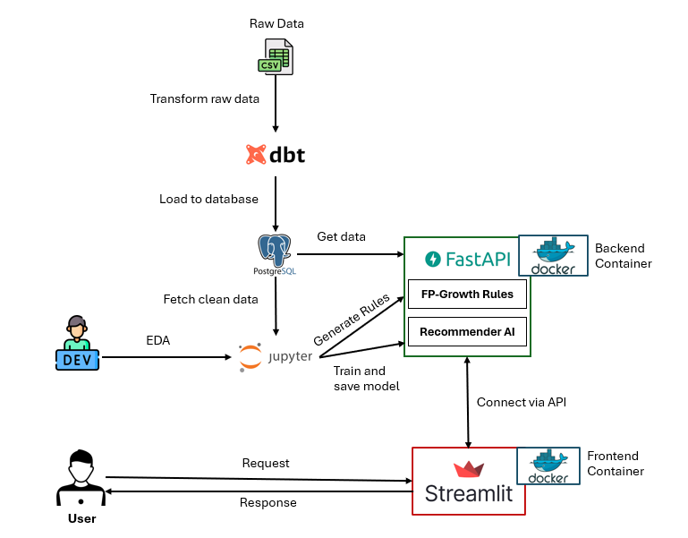

# Market Basket Recommendation System

## 1. Overview

This project builds a recommendation system for the **Market Basket Analysis** problem, using a combination of **FP-Growth** and **Neural Collaborative Filtering (NCF)**.

Given an item as input, the API will return a list of frequently co-purchased items (using FP-Growth). Additionally, the system integrates a personalized recommendation model (NCF) trained with deep learning to enhance accuracy.

## 2. System Architecture



## 3. Tech Stack & Structure

* **Backend:** FastAPI, Python
* **Data Transformation:** dbt (Data Build Tool)
* **Database:** Postgres
* **Frontend:** Streamlit
* **Models:** FP-Growth, Neural Collaborative Filtering (NCF)
* **Containerization:** Docker, Docker Compose

## 4. Installation

### 4.1 Prerequisites

- Docker & Docker-Compose installed

- Python 3.10+ (if running locally without Docker)

### 4.2 Quick Start with Docker

```bash

git clone https://github.com/leeduy0403/Market-Basket-Recommendation-System.git

cd recommendation-systems-rule-base/docker

docker compose up --build

```

#### Access:

- Backend API: http://localhost:8000/docs

- Frontend (Streamlit): http://localhost:8501

### 4.3 Run without Docker (Optional)

#### Run Backend API

```bash

pip install -r requirements.txt

uvicorn backend.main:app --reload

```

#### Run Frontend

```bash

cd ui

streamlit run streamlit_app.py

```

## 5. Run dbt Project

After setting up the environment and database connection, you can now execute the dbt pipeline to transform, clean, and prepare analytical tables

### 5.1 Configure Database Connection

**Create or edit your dbt profiles.yml file:**


- Linux/macOS:

```bash

~/.dbt/profiles.yml

```

- Windows:

```bash

%USERPROFILE%\.dbt\profiles.yml

```

Example:

```yml

dbt_project:

  target: dev

  outputs:

    dev:

      type: postgres

      host: localhost

      user: postgres

      password: your_password

      port: 5432

      dbname: fp_growth_mba

      schema: public

      threads: 4

      keepalives_idle: 0

```

### 5.2 Initialize dbt

```bash

cd dbt_project

dbt deps

```

This command installs all dbt packages defined in the **packages.yml** file, such as:

- dbt_utils

- dbt_labs

A package-lock.yml file will be automatically created to lock dependency versions.

### 5.3 Seed data

```bash

dbt seed

```

This command loads the CSV files located in the **seeds**/ folder into your PostgreSQL database.

These raw datasets act as the foundation for all subsequent transformations.

### 5.4 Run Models

```bash

dbt run

```

This executes all dbt models (SQL transformations) defined in your **models**/ directory.

It will build the cleaned and transformed tables — for example:

- stg_online_retail

- user_item_dl

- transaction_fpgrowth

All models will be materialized in your target schema (e.g., public) of the PostgreSQL database.

### 6.5 Test Models (Optional)

```bash

dbt test

```

Runs all the defined data tests in your project to validate data quality, such as:

- Non-null checks

- Uniqueness constraints

- Referential integrity

### 6.6 Export Models to CSV

```bash

cd utils

python export_data.py

```
This script connects to your fp_growth_mba PostgreSQL database and exports the final dbt model tables (e.g., transaction_fpgrowth, user_item_dl) as CSV files into the **data**/ directory.

### 6.7 Summary Workflow

- Install dependencies -> dbt deps

- Load raw data -> dbt seed

- Run transformations -> dbt run

- (Optional) Test data -> dbt test

- Export results -> python export_data.py

## 7. API Overview

Base URL: http://localhost:8000

Interactive Docs

- Swagger UI: http://localhost:8000/docs


### Example Requests

Recommend by Item

```cpp

GET /recommend/by-item?item=charlotte+bag+suki+design&top_k=3

```

Response:

```cpp

{

    "item": "charlotte bag suki design",

    "suggestions": [

        {

            "item": "red retrospot charlotte bag",

            "score": 0.5094

        },

        {

            "item": "woodland charlotte bag",

            "score": 0.4137

        },

        {

            "item": "strawberry charlotte bag",

            "score": 0.4

        }

    ]

}

```

Recommend by User

```cpp

GET /recommend/by-user?user_id=17841&top_k=3

```

Response:

```cpp

{

    "user_id": 17841,

    "suggestions": [

        {

            "item": "magic garden felt garland",

            "score": 1.0

        },

        {

            "item": "house shape pencil sharpener",

            "score": 1.0

        },

        {

            "item": "office mug warmer polkadot",

            "score": 1.0

        }

    ]

}

```

### ✅ Status Codes

- 200 OK – Request successful
- 422 Unprocessable Entity – Missing or invalid query parameters